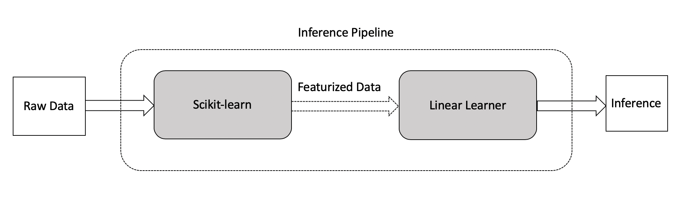

# SageMaker Inference Pipeline

In the following notebook, we will demonstrate how you can build your ML Pipeline leveraging the Sagemaker Scikit-learn container and SageMaker Linear Learner algorithm & after the model is trained, deploy the Pipeline (Data preprocessing and Lineara Learner) as an Inference Pipeline behind a single Endpoint for real time inference and for batch inferences using Amazon SageMaker Batch Transform.

## Dataset
The dataset is available from UCI Machine Learning; the aim for this task is to determine age of an Abalone (a kind of shellfish) from its physical measurements. We'll use Sagemaker's Scikit-learn container to featurize the dataset so that it can be used for training with Linear Learner.

**Numeric Features:**
* length:  Longest shell measurement
* diameter: Diameter perpendicular to length
* height:  Height with meat in shell
* whole_weight: Weight of whole abalone
* shucked_weight: Weight of meat
* viscera_weight: Gut weight (after bleeding)
* shell_weight: Weight after being dried

**Categorical Features:**
* sex: categories encoded as strings {'M', 'F', 'I'} where 'I' is Infant

## Inference
We will use SageMaker Linear Learner algorithm to infer the number of rings on the Abalone and use it for determining its age - rings +1.5 == the age in years.

## Preprocessing 
The first part of our pipeline will use Scikit-learn to do preprocessing. The `sklearn_abalone_featurizer.py` contains the preprocessing code. 

## Training 

Once the data has been preprocessed , we will feed that to SageMaker's built in Linear Learner algorithm for training

## Pipeline Setup

In this example, we configure our pipeline model with the fitted Scikit-learn inference model and the fitted Linear Learner model. Deploying the model follows the same deploy pattern in the SDK.

